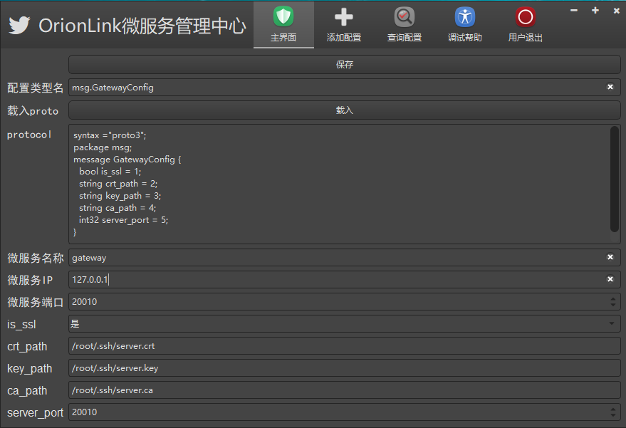

# Linux 下 OrionLink 编译安装说明

## 1 依赖编译安装

```shell
# 先安装一些公共的工具
apt-get install perl g++ make automake libtool unzip
```

### zlib （protobuf，libevent） （压缩）

```shell
tar -xvf zlib-1.2.11.tar.gz
cd zlib-1.2.11/
./configure
make -j32
make install
# 安装在 /usr/local/include/ /usr/local/lib 目录下
```

### openssl （libevent） （安全加密）

```shell
tar -xvf openssl-1.1.1.tar.gz
cd openssl-1.1.1/
./config
make -j32
make install
# openssl 命令行 /usr/local/bin
#配置安装在 /usr/local/ssl
#头文件/usr/local/include/openssl
#so库文件/usr/local/lib
```

### protobuf （通信协议）

```shell
unzip protobuf-all-3.8.0.zip
cd protobuf-3.8.0/
./configure
make -j32
make install
#安装在 /usr/local/include/google/protobuf
# protoc /usr/local/bin
# so库文件 /usr/local/lib
```

### libevent （网络通信）

```shell
unzip libevent-master.zip
./autogen.sh
./configure
make -j32
make install
#安装在 /usr/local/lib /usr/local/include
```

### 安装 mysql

```shell
sudo apt-get install mysql-server
/etc/mysql/debian.cnf文件，在这个文件中有系统默认给我们分配的用户名和密码
mysql -u debian-sys-maint -p
set password for 'root'@'localhost' = password('yourpass')
```


## 2 安装运行OrionLink 

### 预备工作

+ 生成openssl证书和私钥

```shell
# 切换root用户
cd /root/.ssh
openssl genrsa -out server.key 2048 # 生成私钥
openssl req -new -key server.key -out server.csr # 生成证书请求
openssl x509 -req -days 365 -in server.csr -signkey server.key -out server.crt # 自签名证书
```

+ 先进入 src/api_gateway 目录

```shell
cd src/api_gateway
```

+ 打开 router_service.cpp 将代码改成如下

````c++
ServiceHandle* RouterService::CreateServiceHandle()
{
    auto router = new RouterHandle();
    //bool is_ssl = ConfigClient::GetInstance()->GetBool("is_ssl");
    //if (!is_ssl)
    //    return router;

    /// 已经设置过，暂时不考虑修改
    //if (ssl_ctx())
    //    return router;

    auto ctx = new SSLCtx();
    if (ctx == nullptr)  return router;
    //string crt_path = ConfigClient::GetInstance()->GetString("crt_path");
    //string key_path = ConfigClient::GetInstance()->GetString("key_path");
    //string ca_path = ConfigClient::GetInstance()->GetString("ca_path");
    string crt_path = "/root/.ssh/server.crt";
    string key_path = "/root/.ssh/server.key";
    string ca_path = "/root/.ssh/server.ca";
    ctx->InitServer(crt_path.c_str(), key_path.c_str(), ca_path.c_str());
    this->set_ssl_ctx(ctx);
    return router;
}
````

+ 进入bin目录开始编译

````shell
sudo build_all.sh
````

### 添加网关配置

+ 在 /bin/ 目录下安装云盘客户端的配置管理工具
+ 添加数据库连接配置文件
+ 先进入mysql客户端创建orion_link数据库 

````shell
mysql -u root -p
# 创建数据库
CREATE DATABASE orion_link;

# 开始生成配置文件
sudo build_mysql_conf # 填写用户名、密码、数据库名称、端口号
````

+ 先运行注册中心、网关、鉴权中心和配置中心

```shell
sudo start_register_server
sudo start_config_server
sudo start_api_gateway
sudo start_auth
```

+ 运行云盘客户端、注册root用户
+ 运行配置管理工具，登陆root账号，添加网关配置


+ 根据页面显示，填写配置中心IP和端口。开始连接
+ 连接成功后，点击添加配置



+ 先填写配置类型名，和图中一致
+ 点击载入，载入 /src/platform 目录下的 msg_comm.proto 文件
+ 如果填写未出错，显示和图中一致
+ 填写网关的 IP 和 端口，其他可以保持一致
+ 最后点击保存、如果显示上传配置成功，则代表网关配置已经上传成功

**注：其他的微服务配置安装上面的流程配置**


### 运行

+ 进入 src/api_gateway 目录

```shell
cd src/api_gateway
```

+ 打开 router_service.cpp 将代码恢复

```c++
ServiceHandle* RouterService::CreateServiceHandle()
{
    auto router = new RouterHandle();
    bool is_ssl = ConfigClient::GetInstance()->GetBool("is_ssl");
    if (!is_ssl)
        return router;

    /// 已经设置过，暂时不考虑修改
    if (ssl_ctx())
        return router;

    auto ctx = new SSLCtx();
    if (ctx == nullptr)  return router;
    string crt_path = ConfigClient::GetInstance()->GetString("crt_path");
    string key_path = ConfigClient::GetInstance()->GetString("key_path");
    string ca_path = ConfigClient::GetInstance()->GetString("ca_path");
    ctx->InitServer(crt_path.c_str(), key_path.c_str(), ca_path.c_str());
    this->set_ssl_ctx(ctx);
    return router;
}
```

+ 先将 /etc/ol_mysql_init.conf 文件做好备份

```shell
sudo cp /etc/ol_mysql_init.conf /root/
```

+ 再进入bin目录开始编译

```shell
sudo clear_all.sh
sudo build_all.sh
```

+ 再将 ol_mysql_init.conf 备份的文件复制到 /etc/ 下

```shell
sudo cp /root/ol_mysql_init.conf /etc/
```

+ 运行全部微服务

```shell
sudo start_all.sh
```

+ 运行云盘客户端开始登陆


